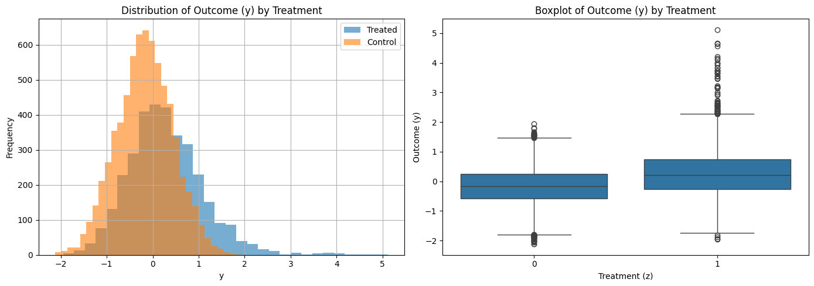
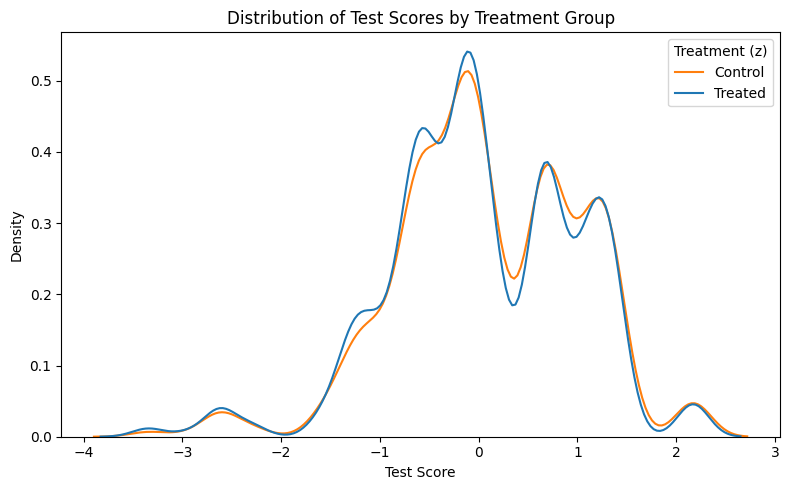
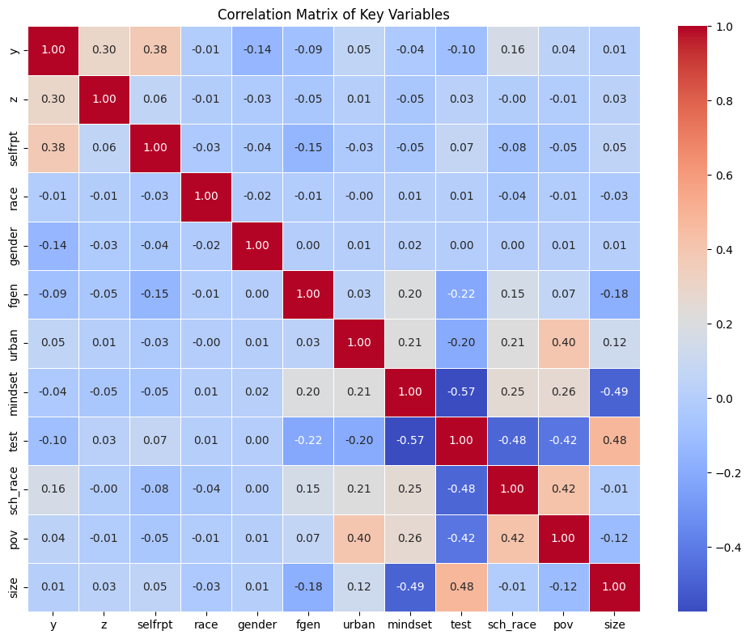
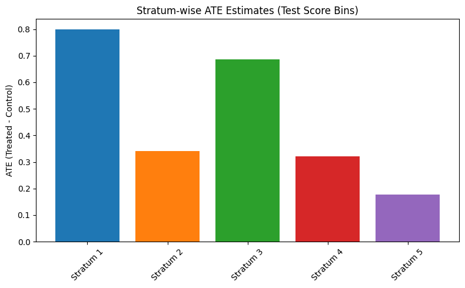
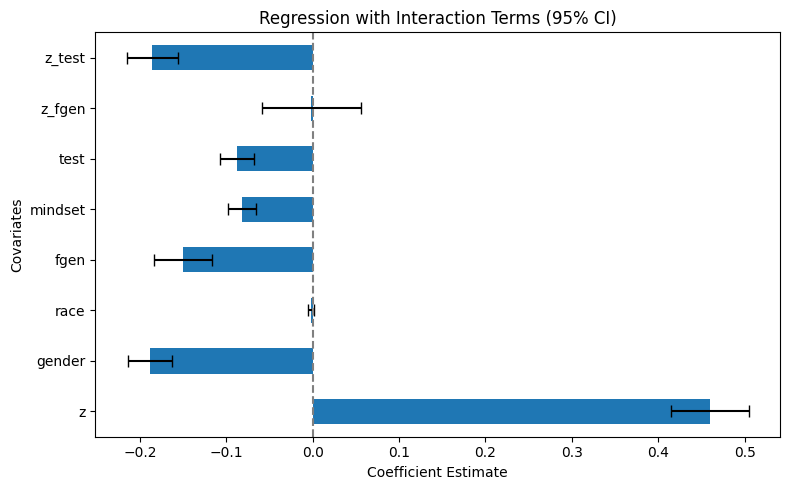
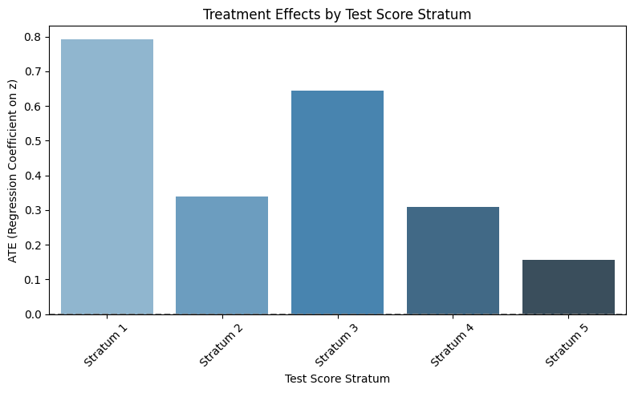
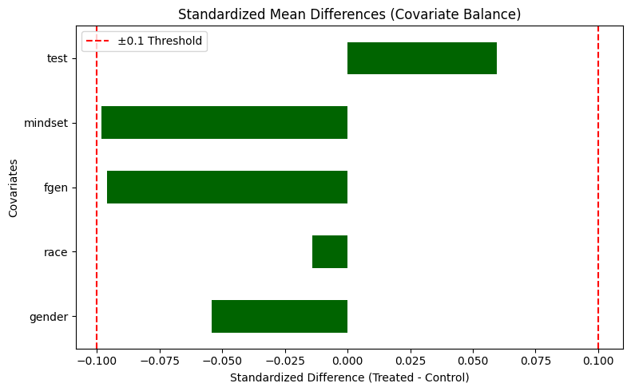
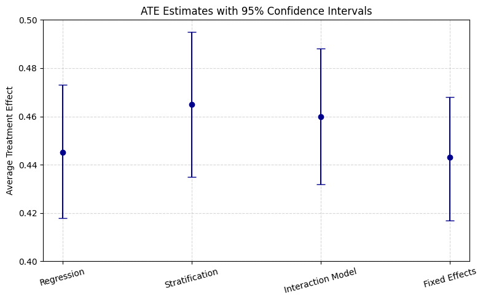

## Author

**Varun Mehrotra**  
Rutgers University - New Brunswick
MSDS 954 567: Statistical Models and Computing

---

# Project: Estimating the Causal Effects of a Growth Mindset Intervention on Academic Performance

This project estimates the causal effect of a growth mindset intervention on student academic performance. The analysis is inspired by the National Study of Learning Mindsets and uses a synthetic dataset modeled around a brief online intervention designed to encourage the belief that intelligence can improve with effort.

The main goal of the project is to estimate the Average Treatment Effect (ATE) of the intervention and examine whether the treatment effect varies across student groups, especially by prior test performance and first-generation student status.

---

## Project Overview

Transitioning to high school can be especially difficult for lower-performing students. Growth mindset interventions are designed to help students believe that academic ability is not fixed and can improve through effort, strategy, and persistence.

This project uses statistical modeling and causal inference techniques to answer the following question:

> Does receiving a growth mindset intervention improve academic outcomes?

The project evaluates this using regression adjustment, stratification, interaction models, school fixed effects, and covariate balance checks.

---

## Dataset

The dataset contains student-level observations with treatment, outcome, demographic, academic, and school-level variables.

The main dataset file is:

```text
data.csv
```

The dataset contains:

```text
10,391 students
76 schools
13 variables
```

### Key Variables

| Variable | Description |
|---|---|
| `y` | Standardized academic outcome |
| `z` | Treatment indicator, where 1 = treated and 0 = control |
| `selfrpt` | Self-reported student measure |
| `race` | Student race category |
| `gender` | Student gender category |
| `fgen` | First-generation student indicator |
| `urban` | Urbanicity category |
| `mindset` | Student mindset score |
| `test` | Prior test score |
| `sch_race` | School-level racial composition |
| `pov` | School poverty measure |
| `size` | School size measure |
| `schoolid` | School identifier |

---

## Research Question

The central research question is:

```text
What is the causal effect of a growth mindset intervention on academic performance?
```

The project also investigates whether this treatment effect differs across student subgroups, especially:

- Students with lower prior test scores
- First-generation students
- Students from different school contexts

---

## Methods Used

The project applies multiple causal analysis methods to estimate and validate the treatment effect.

### 1. Regression Adjustment

An ordinary least squares regression model was used to estimate the treatment effect while controlling for observed covariates.

The model controlled for variables such as:

```text
gender
race
fgen
mindset
test
```

Main result:

```text
ATE = 0.445
95% CI = (0.418, 0.473)
```

This suggests that students who received the intervention had higher academic outcomes, after adjusting for background characteristics.

---

### 2. Stratification by Test Scores

Students were divided into five strata based on test score quintiles. The treatment effect was estimated within each stratum and then combined into a weighted average.

Main result:

```text
Stratified ATE = 0.465
```

This approach helps examine whether the intervention effect differs by prior academic performance.

---

### 3. Regression with Interaction Terms

The regression model was extended to include interaction terms:

```text
z * fgen
z * test
```

This allowed the analysis to test whether the treatment effect varies by first-generation student status and prior test performance.

Main result:

```text
Interaction Model ATE = 0.460
```

The interaction analysis suggests stronger treatment effects for lower-scoring students and variation across student groups.

---

### 4. Separate Regressions by Test Score Stratum

Separate regression models were fitted within each test score stratum.

Estimated treatment effects by stratum:

| Test Score Stratum | Estimated Treatment Effect |
|---|---:|
| Stratum 1 | 0.79 |
| Stratum 2 | 0.34 |
| Stratum 3 | 0.64 |
| Stratum 4 | 0.31 |
| Stratum 5 | 0.16 |

The results suggest that the intervention had the strongest effect among students in the lowest test score group.

---

### 5. Covariate Balance Check

Standardized mean differences were used to compare treated and control groups across key covariates.

Covariates checked:

```text
gender
race
fgen
mindset
test
```

All standardized mean differences were below ±0.1, suggesting good pre-treatment balance between the treatment and control groups.

---

### 6. School Fixed Effects Regression

A school fixed effects model was also estimated to account for school-level differences.

This model included school identifiers as fixed effects:

```text
C(schoolid)
```

The fixed effects model estimated a treatment effect close to the main regression estimate, supporting the robustness of the findings.

---

## Key Results

Across methods, the estimated treatment effect remained positive and consistent.

| Method | Estimated ATE |
|---|---:|
| Regression Adjustment | 0.445 |
| Stratification | 0.465 |
| Interaction Model | 0.460 |
| School Fixed Effects | 0.443 |

These results suggest that the growth mindset intervention had a positive effect on academic outcomes.

The effect appears strongest for students with lower prior academic performance, indicating that the intervention may be especially beneficial for students who are more academically at risk.

---

## Visualizations

The project includes several visualizations stored in the `img/` folder.

### Exploratory Data Analysis

The EDA visualizations examine outcome distributions, treatment group differences, and relationships between key covariates.

```text
img/eda-plots.png
img/kde_eda.png
img/boxplot_eda.png
img/corr_eda.png
```







---

### Regression and Treatment Effect Results

These plots show regression coefficients, stratified treatment effects, and interaction model results.

```text
img/regression plot.png
img/ate-estimates.png
img/regression_interaction.png
img/interactionplot-results.png
img/treatment-effect-stratum.png
```








---

### Covariate Balance

The covariate balance plot shows standardized mean differences between treated and control groups.

```text
img/covariate_balance.png
```



---

### ATE Error Plot

The ATE error plot compares treatment effect estimates and confidence intervals across methods.

```text
img/ate_error_plot.png
```



---

## Assumptions

The causal analysis relies on several important assumptions.

### Conditional Ignorability

After adjusting for observed covariates, treatment assignment is assumed to be independent of potential outcomes.

### Positivity

Every student is assumed to have a non-zero probability of receiving either treatment or control.

### No Unmeasured Confounding

The analysis assumes that the included covariates account for the main confounding factors.

### SUTVA

The Stable Unit Treatment Value Assumption assumes that one student's treatment does not affect another student's outcome.

---

## Limitations

Some limitations of the project include:

- The dataset is synthetic and may not fully capture real-world student behavior.
- Unmeasured factors such as motivation, classroom environment, teacher quality, or peer influence may affect outcomes.
- The treatment effect may not generalize perfectly to real educational settings.
- SUTVA may be violated if students influence each other after receiving the intervention.
- The analysis controls for key observed variables but cannot fully rule out hidden confounding.

---

## Project Structure

```text
Growth-Mindset-Causal-Inference/
│
├── README.md
├── VM749_Stat-Project.ipynb
├── vm749_StatComp_Poster.pdf
├── data.csv
│
└── img/
    ├── ate-estimates.png
    ├── ate_error_plot.png
    ├── boxplot_eda.png
    ├── corr_eda.png
    ├── covariate_balance.png
    ├── eda-plots.png
    ├── interactionplot-results.png
    ├── kde_eda.png
    ├── regression plot.png
    ├── regression_interaction.png
    └── treatment-effect-stratum.png
```

---

## Requirements

The project uses Python and the following main libraries:

```text
pandas
numpy
matplotlib
seaborn
statsmodels
jupyter
```

Install dependencies using:

```bash
pip install pandas numpy matplotlib seaborn statsmodels jupyter
```

---

## How to Run

1. Clone the repository.

```bash
git clone https://github.com/varun11i/Growth-Mindset-Causal-Inference.git
cd Growth-Mindset-Causal-Inference
```

2. Install the required packages.

```bash
pip install pandas numpy matplotlib seaborn statsmodels jupyter
```

3. Open Jupyter Notebook.

```bash
jupyter notebook
```

4. Run the notebook.

```text
VM749_Stat-Project.ipynb
```

The notebook performs data exploration, causal analysis, regression modeling, stratification, interaction analysis, covariate balance checks, and visualization generation.

---

## Notes

- The temporary Word lock file `~$ster_draft-text.docx` should not be uploaded.
- The `.DS_Store` and `__MACOSX/` files are macOS-generated files and should be ignored.
- The poster PDF is included for a concise presentation of the project.
- The main analysis is contained in the Jupyter notebook.

---
